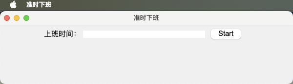
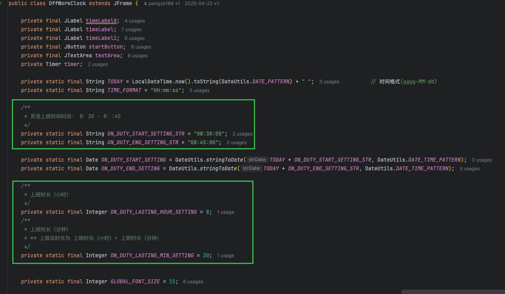

# OffWorkClockApp
准时下班APP, 旨在让打工人们可以准备算出自己灵活下班的下班时间

1 填入上班时间

2 按start, 可计算出下班时间 和 离下班还有多久

上班时间配置,可根据自己的实际情况配置

配置完成后可用命令重新打包
jpackage --input .  \
--name 准时下班 \
--main-jar OffWorkClockApp.jar \
--main-class org.example.OffWorkClock \
--icon asu8d-4jufr.icns \
--type dmg \
--dest .
